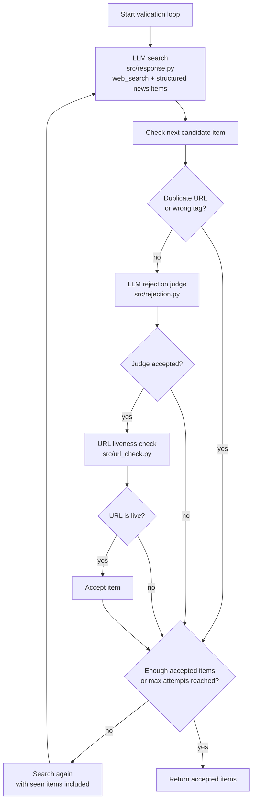

# Personalized Game Newsletter

Personalized Game Newsletter is a small Python app that searches for current gaming news, filters the results against your interests, and emails a formatted daily digest.

## Validation Loop



## Setup

Create and activate a virtual environment:

```bash
python3 -m venv .venv
source .venv/bin/activate
```

Install dependencies:

```bash
pip install openai python-dotenv pydantic requests langsmith pytest
```

Create a `.env` file:

```env
OPENAI_API_KEY=your_openai_api_key
SEARCH_MODEL=your_search_capable_model

SMTP_HOST=smtp.example.com
SMTP_PORT=587
SMTP_USER=your_email@example.com
SMTP_PASSWORD=your_smtp_password
EMAIL_TO=recipient@example.com

# Optional
EMAIL_FROM=your_email@example.com
EMAIL_SUBJECT=Gaming News Digest
LANGSMITH_TRACING=false
LANGSMITH_API_KEY=
LANGSMITH_PROJECT=
```

## Configure Your Newsletter

Edit `config/settings.json`:

```json
{
  "username": "Your Name",
  "consoles": [
    "PC",
    "Switch and Switch 2"
  ],
  "tags": [
    "Pokemon",
    "Resident Evil",
    "Zelda"
  ]
}
```

Supported console values are:

- `SteamDeck and SteamMachine`
- `PC`
- `Switch and Switch 2`
- `Playstations`
- `XBOX`

Remove consoles you do not own. The app expects the exact strings above.

The `tags` list is where you put the franchises, games, or gaming topics you want to follow. The app also adds a few broad built-in tags for industry and hardware coverage.

## Run

```bash
python src/app.py
```

The app will:

- Search for current gaming news
- Validate up to 3 items
- Save the run in `data/query_history.jsonl`
- Print a Markdown digest in the terminal
- Send the email digest

If fewer than 3 valid items are found, the app still sends an email with whatever it found. If it finds 0 items, the email contains a short sorry message.

## Current Defaults

The app currently targets 3 validated news items and allows up to 10 search attempts per run. Those constants live in `src/app.py`.
